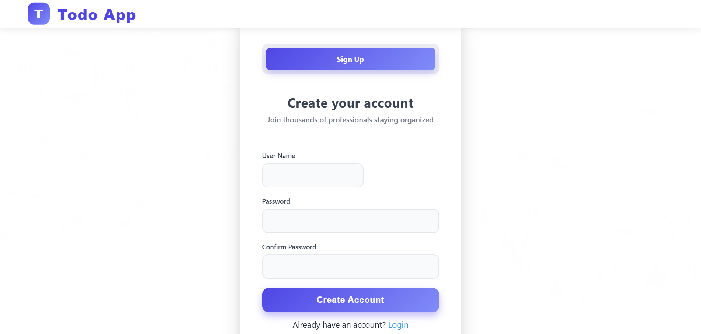
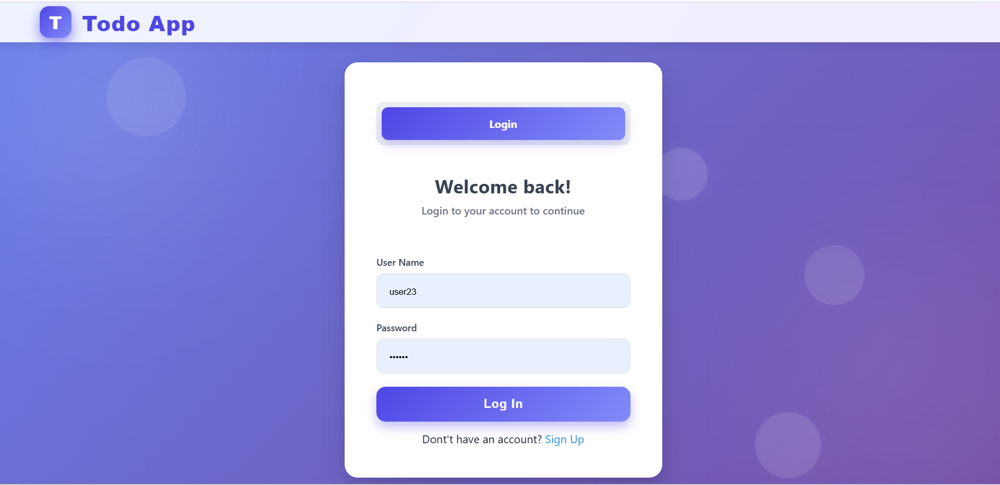
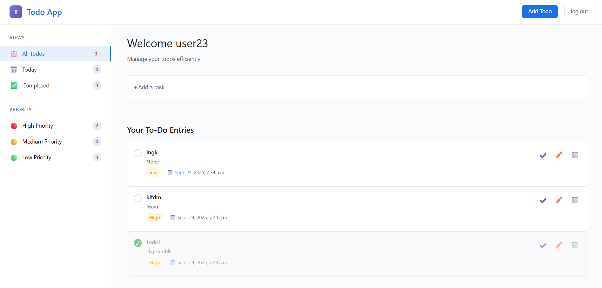

# 📝 Django To-Do App

A simple yet powerful **To-Do List application** built with Django.  
It allows users to sign up, log in, and manage their tasks efficiently based on **priority**.

---

## 🚀 Features
- **User Authentication**: Sign Up, Login, Logout
- **Add Tasks** with title, description, and priority
- **View Tasks** by priority (High, Medium, Low)
- **Edit & Delete** existing tasks
- **Responsive UI** for better experience
- **Track today’s created tasks count**

---

## 📸 Screenshots

### Sign Up Page

### Login Page

### Dashboard / To-Do List

---

## 🛠 Tech Stack
- **Backend**: Django (Python)
- **Frontend**: HTML, CSS
- **Database**: SQLite (default)

---

## 📦 Installation & Setup 

1. **Clone the repository**
   git clone https://github.com/your-username/your-repo-name.git
   cd your-repo-name

2. **Create & activate a virtual environment**
    python -m venv venv
# Windows
    venv\Scripts\activate
# Mac/Linux
    source venv/bin/activate

3. **Install dependencies**
    pip install -r requirements.txt

4. **Run migrations**
    python manage.py migrate

5. **Start the development server**
    python manage.py runserver

6. **Open in browser:**
    http://127.0.0.1:8000/

📂 Folder Structure

project/
│
├── todo/                 # Main app
├── templates/            # HTML templates
├── static/               # CSS & static files
├── db.sqlite3             # SQLite database
├── manage.py
├── requirements.txt
└── README.md

🧑‍💻 Author

Sarika Rana
📧 sarikaran781@gmail.com
💼 https://www.linkedin.com/in/sarikarana/

📜 License

This project is licensed under the MIT License - feel free to use and modify.